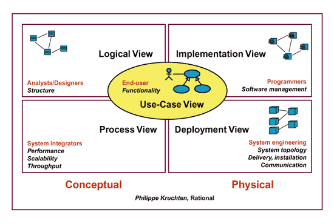
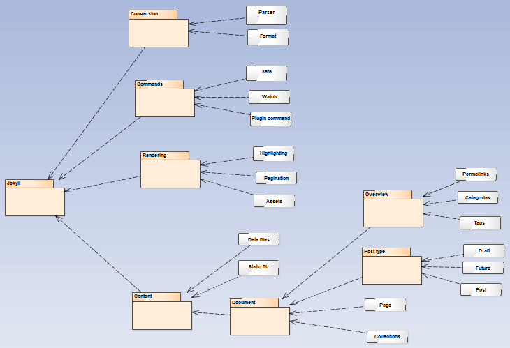
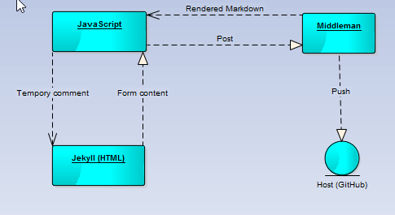
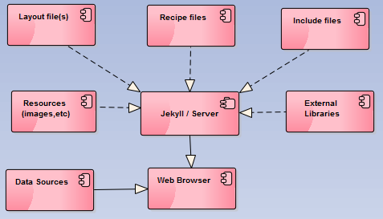
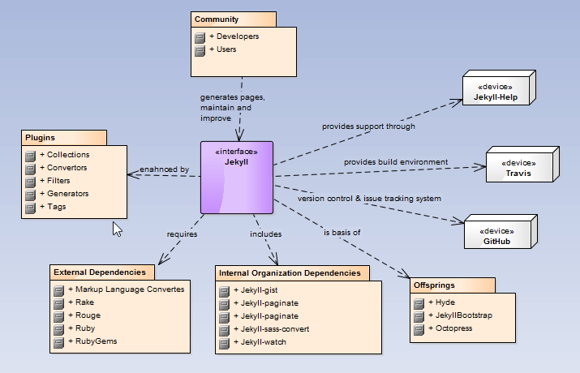

# 4+1 Architecture

##Intro

In this report we will focus on the 4+1 architecture of Jekyll and its view model. 

But what is 4+1 Architecture?
	It simply is a way of describing the architecture of software-intensive systems, based on the use of multiple, concurrent views.The views are used to describe the system from the viewpoint of different stakeholders, such as end-users, developers and project managers.	
	In the 4+1 architecture figure 4 view models: **Logical View**, **Process View**, **Implementation View** and **Deployment View** . We will now expose each one of these. 

##Logical View

The Logical View is the one about the structure, packaging and classes of the software we are analysing. In Jekyll it goes like this:

Jekyll divides itself in 4 main packages: **Conversion**, **Commands**, **Rendering** and **Content**. 

*The **Conversion** package contains the **Parser** class (with all the parsing methods needed from [*Kramdown*](http://kramdown.gettalong.org/), [*Maruku*](https://github.com/bhollis/maruku), [*Red Carpet*](https://github.com/vmg/redcarpet), [RDiscount](https://github.com/davidfstr/rdiscount) to plugin parser. These are mainly different 
*Mardown* parsers) aswell as the **Format** class ([*Mardown*](https://help.github.com/articles/markdown-basics/), [*Latex*](https://www.latex-project.org/) and some other formats that you files may include).

*The **Commands** package 

*The **Rendering* package deals with the rendering of your files (the highlightning, pagination,assets,...)

*The **Content** package contains the user files. The **Data files** manages files like *.yml* and *.yaml*, *.json* and finally *.csv*. Then the **Document ** package contains the rest of the information about your website. 

##Process View

The Process View relates to the behavior of the software during its execution.

Jekyll renders your files (*HTML*) and after generating it using [*Middleman*](https://middlemanapp.com/), hosts it (preferebly in GitHub).

##Implementation View

The Implementation View shows the **component** diagram that shows how the differnt components of the software relate between themselves.

All the components (Layout files, Recipe files, Include files, Resouces, External Libraries) are bound together through Jekyll and combined with the Data Sources generate your static website.

##Deployment View

The Deployment View allows to see how the artifacts(software components) of the software system in study are represented and distributed through hardware nodes. 

As explained in the diagram above, in the hardware level Jekyll divides itself in **Plugins**, **External Dependencies**, **Internal Organization Dependencies** and **Offsprings**. All the devices are help support, build environment software and hosts.   