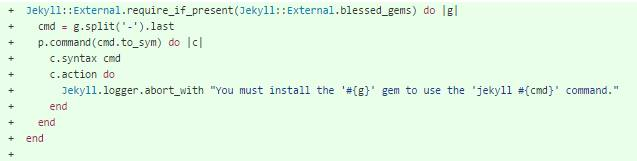

#Feature Implementation

#Introduction

As we have been trying to show, Jekyll is quite a big project. It has been quite troublesome to understand all that the program does, not only due to its size and complexity, but also because it is written in *ruby*, a programming language which is not familiar to us. We tryed our best to make a feature for Jekyll, but we just don't know Ruby that much to create a fixture for such a high developed project. So instead, we analysed a fixture recently implemented by one of the major contributors. 

#Feature implementation

The commit is in [here](https://github.com/jekyll/jekyll/commit/31b0e88b0788cbaf01c4b9159ef3c0df7bdfb030). 
The purpose of this feature is, has the commit describes, "For blessed gems, shim their commands so users know how to use them".

Here is the feature:

Simply. what it does is when you try to perform a jekyll command which requires a especific *rubygem* which you don't have installed, the program logs the name of the missing gem to perform the command you are trying to execute.

