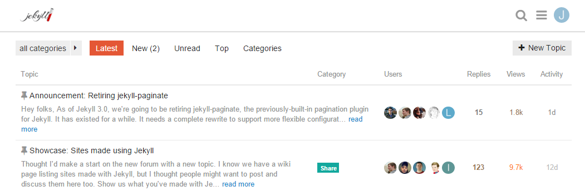
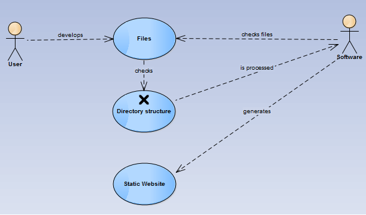

#Requirements:

##Description:
Jekyll stands as a software able to read your markup files and process them into a static website. So the software must be able to read *markup languages* (Markdown, Textile, HTML). 

##System Requirements:
Jekyll is best supported by *Linux* (although you are still able to use with it through some other operative systems). You are required  to have *Ruby* and *RubyGems* in order to run the software.

##User Files
The directory structure of your files should look like this:

Therefore, a major requirement for the softwarwe understands and recognizes this structure, which is crucial for the genarating of your website.

##Requirement History

Jekyll keeps record of their releases, bug fixes and feature implementation so that they can track their way, understand the software and user needs and see the course their implemetation has followed. It is explicited here: http://jekyllrb.com/docs/history/

Since Jekyll is still in development, adding new features and fixing bugs, it is possible through the *issues*, *releases*, *labels* and *pull requests* to understand more of its requirements. 
The majority of pull requests ask for a more user friendly aproach and a improved user support. 
Jekyll developed Jekyll Talk in response to the matter. 

It is a debate forum where you can ask, answer and discuss anything Jekyll related, fromn your late masterings of Jekyll to your troubleshooting. Its a great platform. It stores info in diversed categories and allows you to sort the content that you are really looking for. In addiction they have a *troubleshooting* area to answer FAQS, which you can find here: http://jekyllrb.com/docs/troubleshooting/

##Hosts

Since Jekyll only generates your static website, you will need somewhere to host it. As they recomend, GitHub stands a great place to host your website GitHub Pages are powered by Jekyll behind the scenes, so in addition to supporting regular HTML content, they’re also a great way to host your Jekyll-powered website for free.
GitHub Pages work by looking at certain branches of repositories on GitHub. There are two basic types available: user/organization pages and project pages. The way to deploy these two types of sites are nearly identical, except for a few minor details. You can find more on that here: http://jekyllrb.com/docs/github-pages/

##Use case diagram

