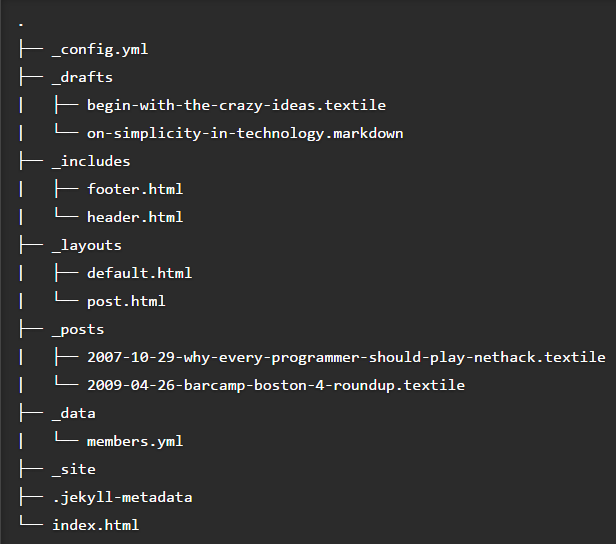

#Requirements:

**Description:**
Jekyll stands as a software able to read your markup files and process them into a static website. So the software must be able to read *markup languages* (Markdown, Textile, HTML). 
Jekyll is best supported by Linux (although you are still able to use with it through some other operative systems). You are required  to have Ruby and RubyGems in order to run the software.
The directory structure of your files should look like this:

Therefore, a major requirement for the softwarwe understands and recognizes this structure, which is crucial for the genarating of your website.

Since Jekyll is still in development, adding new features and fixing bugs, it is possible through the issues, realease, labels and pull requests to understand more of its requirements. 
The majority of pull requests ask for a more user friendly aproach and a improved user support. 
Jekyll developed Jekyll Talk in response to the matter. 

It is a debate forum where you can ask, answer and discuss anything Jekyll related, fromn your late masterings of Jekyll to your troubleshooting. Its a great platform. It stores info in diversed categories and allows you to sort the content that you are really looking for.
