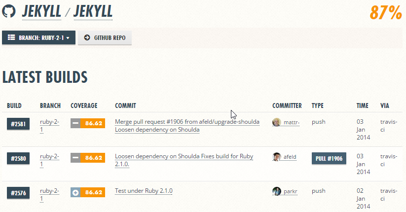
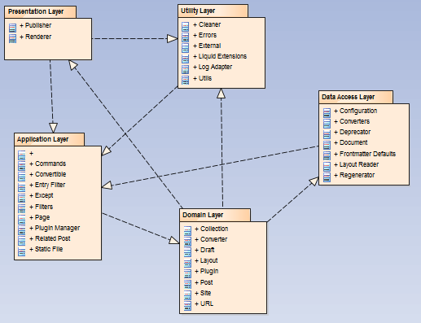
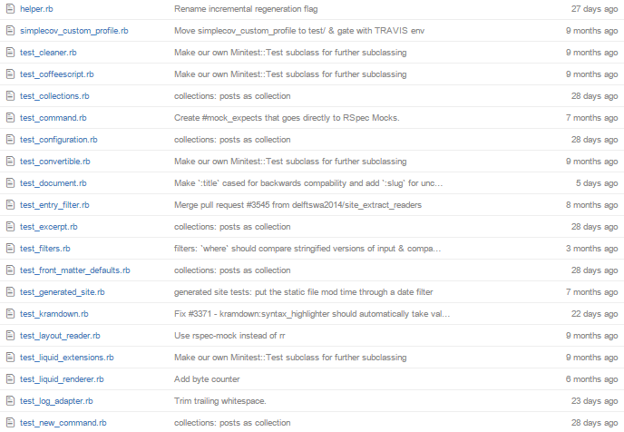

#Verification and Validation

In this report, we will explain verification and validation of software and how Jekyll implements tests.

##Verification vs Validation

**Verification** - "The evaluation of whether or not a product, service, or system complies with a regulation, requirement, specification, or imposed condition. It is often an internal process." (https://en.wikipedia.org/wiki/Verification_and_validation)

**Validation** - " The assurance that a product, service, or system meets the needs of the customer and other identified stakeholders. It often involves acceptance and suitability with external customers." (https://en.wikipedia.org/wiki/Verification_and_validation)

But what does this mean?
Verification stands as understanding if the software developed meets the specifications given at the beggining.
Validation is knowing if the custumores/stakeholders(who might benefit with the software) are happy with the software developed, if it meets their expectations.

#Standardization of Testing

Jekyll has standardized their way of testing. Contributors are asked to make tests when creating a small fix to an existing feature or creating a brand new one. Standardization of the way one should make a test is useful, because everyone involved will know what to do. The Jekyll test suite is making use of [*Shoulda*](https://github.com/thoughtbot/shoulda/), [*RSpec*](https://github.com/rspec/rspec), [*Cucumber*](https://cucumber.io/) and [*MiniTest*](https://github.com/seattlerb/minitest).

[*Shoulda*](https://github.com/thoughtbot/shoulda/) and [*MiniTest*](https://github.com/seattlerb/minitest) are used to make units tests, which reside in the **test** folder. [*RSpec*](https://github.com/rspec/rspec) is used to mock objects and supports stubs, fakes, spies and proxies.  [*Cucumber*](https://cucumber.io/) is a tool for running tests written in a plain language, that can be read by anyone. These tests can be found in the **feature** folder.

##Software Testing

To check if the software is well implemented, Jekyll set a wide variety of tests. We will expose them in order to understand where they focus on.

###Controlability

**Controlabilty** determines the work it takes to set up and run test cases and the extent to which individual functions and features of the system under test (SUT) can be made to respond to test cases. 
Jekyll deals with the matter testing every class, module and package, one at a time. Jekyll tests every render, every parser to ensure everything is correct. (There is more info on this in the previous reports. Check https://github.com/jmepg/jekyll/tree/master/ESOF-docs for detailed description).  This allow to have more control over what is going on.

This ensures that Jekyll component testing is controlable.

###Observability 

**Observability** determines the work it takes to set up and run test cases and the extent to which the response of the system under test (SUT) to test cases can be verified.

Jekyll is also using a continuous integration platform called [*Travis*](https://travis-ci.org/). The config file **.travis.yml** for [*Travis*](https://travis-ci.org/) can be found in the root directory. This way every pull request will be automatically tested on all available tests. 

We used [*Coveralls*](coveralls.io) to check Jekyll's test converage. 

[*Coveralls*](coveralls.io) also allows to go through each branch and analyse each one independantly. 

This is just an example of the analisys of a Jekyll branch. As you can see. The coverage tests where made via [*Travis*](https://travis-ci.org/).

This way, Jekyll's tests are certain to retrieve useful and useable information about it's features.

###Isolateability

**Isolateability** is pretty much if your test cases isn't depending on some external dependency to the portion of code is currently testing.

###Separation of concerns

Since Jekyll is a truly big project, it is really important that it is well structured and each feature is separeted so that the so called spaghetti code smell doesn't happen. 

Jekyll separates its code in 5 different layers:

1. **Presentation Layer**: provides the final user experience.
2. **Application Layer**: controls the data and provides services to various components in the system.
3. **Utility Layer**: is used by every other layer and contains all shared services.
4. **Domain Layer**: contains all the program’s logic, such as Draft, Layouts and Plugins.
5. **Data Access Layer**: provides all the raw data. In this case folders from the disk.

There are some dependencies between the layers as showed below:

###Understandability

Jekyll has a simple rukle to deal with the matter. If the code or test case is not self-explaining, then it is not accepted.

If you want to check all the test cases go to: https://github.com/jekyll/jekyll/tree/master/test.

[*Travis*](https://travis-ci.org/) will  check on code style with [*Rubocop*](https://github.com/bbatsov/rubocop). If a test fails or the code doesn’t satisfy the [*GitHub style guide*](https://github.com/styleguide/ruby) for Ruby, the pull request will not be merged.
This way, they guarantee a high understandable code.

###Heterogeneity

Each fixture or bug fix any contributor desires to implement in a pull request must have its test indexed. Jekyll's main contributors themselfs test the code given in pull requests with the already told tools. But since it is an *open-source* project, it ends up having a high heterogeneity

